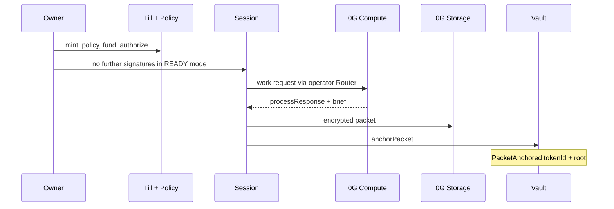
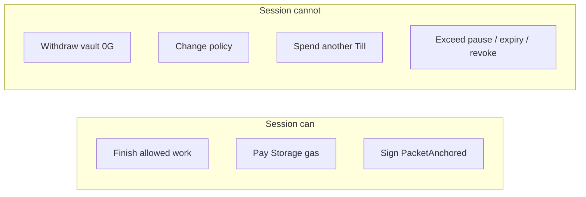

# Till

**Give an agent a Till. It finishes useful work. It cannot empty you.**

A Till is a bounded **native-0G work account** on **0G Aristotle (chain ID 16661)**. You mint it, set TillPolicy, fund the vault, and authorize a device-local session. The session finishes Investigate / Review / Research / Compare on 0G Compute, stores an encrypted packet, and anchors proof on-chain. It cannot withdraw, change policy, or spend another Till.

- App: https://till-0g.vercel.app
- API: https://till-api.onrender.com
- MCP: https://till-api.onrender.com/mcp
- GitHub: https://github.com/Mr-Ben-dev/Till
- SDK: [`till-0g-sdk@0.1.1`](https://www.npmjs.com/package/till-0g-sdk)
- MCP stdio: [`till-0g-mcp@0.1.0`](https://www.npmjs.com/package/till-0g-mcp)

No mock TEE. No OpenAI/Groq fallback. No DA fake. No invented x402 sellers. No relabeling cache as proof.

## One sentence

Tell your agent what you need done. Give it a Till. It finishes the work inside your policy. You get the result and an Aristotle receipt.

## Why Till exists

Autonomous agents need money and compute to finish useful work. Giving them the owner wallet is how people get emptied.

Till separates **owner authority** from **session authority**. Caps live on-chain. Grants are ERC-7857 `authorizeUsage` addresses, not keys in a prompt.

## Why a normal agent wallet is dangerous

A hot wallet can withdraw, approve, and sign anything. A prompt that says “don’t spend more than $5” is not a constraint. TillPolicy is.

## Architecture

```mermaid
flowchart TD
  Owner[Owner wallet] --> Till[Till NFT + Vault]
  Till --> Policy[TillPolicy native 0G]
  Till --> Session[Session EOA]
  Policy --> Compute[0G Compute TEE]
  Compute --> Result[Private result]
  Session --> Storage[0G Storage]
  Result --> Storage
  Storage --> Anchor[PacketAnchored]
  Anchor --> Proof[/verify on Aristotle]
```





## Money and security boundaries

| Rail | Asset | Gate | Signer |
|---|---|---|---|
| Vault | native 0G | **On-chain TillPolicy** | owner (fund / withdraw / pause) |
| Work Desk Compute | 0G Compute tokens | live TeeML catalog | **operator Payment Layer** (labeled — not TillVault) |
| Work Desk proof | native 0G gas | READY session | **session EOA** `anchorPacket` |
| Jobs escrow | native 0G | TillVerifier + owner | owner lock / settle / refund |

Payment Layer `0xA3b15Bd2aD18BFB6b5f92D8AA9F444Dd59d1cE32` bills **operator Compute**. Do not claim “this Till paid 0G Compute” unless a vault `Released` event exists.

Work Desk native 0G spend that the user can see is **Storage gas + PacketAnchored**.

## Work Desk

Primary loop:

`WHAT DO YOU NEED DONE? → PLAN → POLICY → 0G COMPUTE → TEE → RESULT → 0G STORAGE → ON-CHAIN PROOF → VERIFY`

The result is primary. Proof is secondary. Hashes are tertiary.

A new Till: CREATE → PROTECT → FUND → ENABLE AGENT → FIRST WORK. A LIVE Till: Start work.

## Four work families

1. **Investigate** — address / token / protocol. Public Aristotle RPC facts + private 0G Compute. Not a paid scanner.
2. **Review** — Solidity / ABI / diff / contract. AI-assisted — **not a certified audit**.
3. **Research** — private structured brief. Not a chatbot.
4. **Compare** — two addresses or artifacts. Differences, not a scoreboard.

AUTO is the default model choice. CHEAP / FAST / DEEP / PRIVATE are live catalog presets, not a frozen marketing list.

## Autonomous session

READY session = ERC-7857 `authorizeUsage` + session gas + not paused + not expired.

In READY mode, Start work does **not** open MetaMask. The session signs Storage + PacketAnchored only. Compute tokens bill the operator Payment Layer.

Owner still signs: connect, mint, fund, policy, authorize, gas, revoke, withdraw, pause.

## Policy

On-chain: max per purchase, rolling window, pause, session expiry, isolation.

`preview()` is the same math the vault will run before a wei moves on the Jobs path. Work Desk does not debit the vault for model tokens. Pause still fail-closes Work Desk via API `assertMissionGate`.

## 0G integrations

| Piece | Source of truth | Live evidence |
|---|---|---|
| Aristotle 16661 | `GET /health` | `{chainId:"16661",simulate:false}` |
| Compute catalog | `GET /v1/models/live` | Re-queried. Do not freeze a count in copy. |
| TEE | Router `processResponse` | Claimed only when the Router returns it |
| Storage | Flow contract + indexer | Flow tx + root on the packet |
| PacketAnchored | TillVault event | `tokenId` + `rootHash` on Aristotle |
| ERC-7857 | Foundation `0g-agentic-id` HEAD `b8f4845` | Live `supportsInterface` below |
| ERC-8004 | Identity + Reputation bytecode | Validation Registry **not** claimed |

## ERC-7857

Vendor interfaces are **byte-identical** to `0gfoundation/0g-agentic-id` `b8f4845388d3385bf0d57229c484f5089315c92b`.

Live `supportsInterface` on TillAgentNFT `0x730e7c02D1C238D98aD38AFED98a7CBA980901bF` (Aristotle RPC 2026-08-22):

| ID | Interface | Result |
|---|---|---|
| `0x80ac58cd` | IERC721 | true |
| `0x2afbede9` | IERC7857 | true |
| `0xdf597d99` | IERC7857Authorize | true |
| `0x74f8628b` | IERC7857Cloneable | true |
| `0xf9a82da5` | old Till IERC7857 | **false** |
| `0xffffffff` | ERC-165 invalid | **false** |

`iTransferFrom` / `iCloneFrom` revert `SealedKeyAttestorUnavailable`. The Foundation sealed-key attestor is Galileo-only. Till does not fake it. Cloneable **interface support** is true; sealed clone execution is not.

## ERC-8004

Identity `0x8004A169FB4a3325136EB29fA0ceB6D2e539a432` and Reputation `0x8004BAa17C55a88189AE136b182e5fdA19dE9b63` have code on 16661.

[Identity register](https://chainscan.0g.ai/tx/0x6446a6c24a28b23088ef36d92309a3aefbe58b7264da88ae691cb374358ff33a)

**Validation Registry is not deployed on 0G.** Not in marketing.

## Compute / TEE

`GET https://router-api.0g.ai/v1/models` via `GET /v1/models/live`.

- AUTO default
- Spend/security ALLOW requires TeeML + JSON
- `verifiability=None` cannot ALLOW
- No OpenAI/Groq fallback
- If the required model disappears, fail closed

`processResponse` is **not** `TillVerifier.verifyAllow`. The latter is the Jobs lock path.

## Storage and proof

For every production Work Desk run the UI may only say STORED when all of these exist:

1. Storage flow tx
2. Storage root
3. PacketAnchored tx
4. Session signer = `from` on the anchor receipt

`/verify` reconstructs the Aristotle receipt. **On-chain wins.** API durable cache is labeled cache. A Render restart can drop in-API receipts; the chain does not.

## MCP

- Remote HTTP: `POST https://till-api.onrender.com/mcp`
- Local stdio: `npx -y till-0g-mcp`
- Auth: scoped JWT from https://till-0g.vercel.app/developers (owner `personal_sign`)
- Copy-all setup prompt after token issue — Cursor, Claude Code, generic HTTP, stdio
- Never accepts owner / deployer / session private keys
- `till_run_mission` is **operator Compute** and **cannot** Storage-anchor
- `till_revoke_session` does not sign; it returns `/till/agent`

## SDK

```bash
npm install till-0g-sdk
```

```ts
import { createClient } from 'till-0g-sdk'
const till = createClient({
  apiUrl: 'https://till-api.onrender.com',
  token: process.env.TILL_ACCESS_TOKEN,
})
await till.listTills()
await till.getTill('2')
await till.getPolicy()
await till.quoteMission('Investigate this contract. 0x833589fCD6eDb6E08f4c7C32D4f71b54bdA02913')
await till.getProof('0x494a23418750b795ef8070240f0d8bb416b29f7f2f8ffd7613265101f5cbeb50')
await till.getSession()
```

`createClient` rejects missing tokens and values that look like private keys.

## Live mainnet contracts (Aristotle 16661)

v3. Explorer: https://chainscan.0g.ai

| Contract | Address | Create tx |
|---|---|---|
| TillAgentNFT | [`0x730e7c02D1C238D98aD38AFED98a7CBA980901bF`](https://chainscan.0g.ai/address/0x730e7c02D1C238D98aD38AFED98a7CBA980901bF) | [`0x59f24f1e…`](https://chainscan.0g.ai/tx/0x59f24f1e56504ed93b1fdc2b7901c7db56bed4011a9d13ace8e8f1d4a4b75db0) |
| TillPolicy | [`0xBf05e322e3C3047089e9Dd9E10Bd8ee320149f7c`](https://chainscan.0g.ai/address/0xBf05e322e3C3047089e9Dd9E10Bd8ee320149f7c) | [`0x86e6ade3…`](https://chainscan.0g.ai/tx/0x86e6ade3764913aa19de4f28aa14ab5b650f9c2eb5699d41bb93a1f978fa47cb) |
| TillVerifier | [`0x4C8bed5Ec7e1F0c0CC7a7Ef141370dd9f4e1A7f1`](https://chainscan.0g.ai/address/0x4C8bed5Ec7e1F0c0CC7a7Ef141370dd9f4e1A7f1) | [`0xd9fc3e4e…`](https://chainscan.0g.ai/tx/0xd9fc3e4e50ebff47791bbec6cd981b79c757c82837ca0e35c1a64dbfcd8f05a1) |
| TillVault | [`0x2eD09745E5Ca4BdeaBc93aB3aab65781B03Ed4cB`](https://chainscan.0g.ai/address/0x2eD09745E5Ca4BdeaBc93aB3aab65781B03Ed4cB) | [`0xc7be3972…`](https://chainscan.0g.ai/tx/0xc7be3972506842a8794307bbee4f8d41999dce4cef56dce8334ad86e051fab5d) |
| TillJobEscrow | [`0x1BB730Ff8A4Ff93dE9eDD54B178C0Bc9ddE99de9`](https://chainscan.0g.ai/address/0x1BB730Ff8A4Ff93dE9eDD54B178C0Bc9ddE99de9) | [`0xe801cb7f…`](https://chainscan.0g.ai/tx/0xe801cb7f12dba2b34ef47227a805b3993111900449c6d9f58d6cb62ab0452c42) |

JSON: `packages/contracts/deployments/16661.json`

## Explorer proofs (Work Desk)

| Event | Tx |
|---|---|
| Investigate storage flow | [`0x913cae3a…`](https://chainscan.0g.ai/tx/0x913cae3a6aaaea0949bac9f27427bd338ac2ad21479427b9c62d5dfb7f05c860) |
| Investigate PacketAnchored Till 2 (session `0x06d47E…052f`) | [`0x494a2341…`](https://chainscan.0g.ai/tx/0x494a23418750b795ef8070240f0d8bb416b29f7f2f8ffd7613265101f5cbeb50) |
| Review storage flow | [`0x18365995…`](https://chainscan.0g.ai/tx/0x18365995d04d825c204ccf1a56a52452fb3548779f59f73d6babc500f0b22d88) |
| Review PacketAnchored | [`0x34be2264…`](https://chainscan.0g.ai/tx/0x34be22641171b57c197408461ded8e7bf8328771ca285292b2bfafe36f1d6403) |
| Research storage flow | [`0x4707bf70…`](https://chainscan.0g.ai/tx/0x4707bf70d38290b59bce2001fa4acb764df1a46a5fae3b08c45db6833bca9989) |
| Research PacketAnchored | [`0xb9539236…`](https://chainscan.0g.ai/tx/0xb953923663552262965ab0d745cdd0fe496b71f963fd19f8b3d6cf70be4983d4) |
| Compare storage flow | [`0xbae0b808…`](https://chainscan.0g.ai/tx/0xbae0b8083de50838d409e833ddfc5b8ed8711c294d27cbe5b1b26c857f4a98bc) |
| Compare PacketAnchored | [`0x8d8dfce5…`](https://chainscan.0g.ai/tx/0x8d8dfce597bccccd506e933264cf8d5c111471399c0dc01a5f4c788dc3cd1f12) |
| Till #2 mint | [`0x02b13836…`](https://chainscan.0g.ai/tx/0x02b138362ded4b4930a55c3ab96eee9521b0eec009c90824cb0beb22326472d6) |
| Fund 0.02 0G | [`0x8fb641a8…`](https://chainscan.0g.ai/tx/0x8fb641a85bdfe99a222399fbe25843c0bbdd2ad69b8f3063428997aabe3073d5) |
| ERC-8004 Identity register | [`0x6446a6c2…`](https://chainscan.0g.ai/tx/0x6446a6c24a28b23088ef36d92309a3aefbe58b7264da88ae691cb374358ff33a) |
| Jobs settle | [`0x50b1052f…`](https://chainscan.0g.ai/tx/0x50b1052fb6aa6b133d013f631f584867a6d14fdc685bc789f9ff9ba84666bbdc) |
| Jobs refund | [`0x3695d0ff…`](https://chainscan.0g.ai/tx/0x3695d0ffb906e4c3d82bd3a610276ba738bfca214113ce6b1f2b1117c6e60bad) |

Verify any hash with no wallet: https://till-0g.vercel.app/verify

## Test matrix

Recorded 2026-08-22:

- Foundry **69/69** (unit + fuzz 256 + invariant 64×1280 + reentrancy)
- API unit: compiler + mcp-auth + x402 resource **13/13**
- `web:build` **PASS**
- Live `supportsInterface` as tabled above
- Chrome Till 2 READY: Investigate + Review + Research + Compare, no MetaMask, TEE + Storage + PacketAnchored
- Over-budget UI test: **5 0G requested · 0 moved**

Research / Compare fresh mainnet, Chrome pause / revoke, and clean-dir npm install are re-run after each production SHA. See `history.md` locally (not in GitHub).

## Production URLs

| Surface | URL |
|---|---|
| App | https://till-0g.vercel.app |
| API health | https://till-api.onrender.com/health |
| MCP | https://till-api.onrender.com/mcp |
| Verify | https://till-0g.vercel.app/verify |
| Developers | https://till-0g.vercel.app/developers |

## Security model

| Actor | Can | Cannot |
|---|---|---|
| Owner | Mint, fund, policy, authorize, revoke, withdraw, pause | Be impersonated by MCP |
| Session | Anchor proof when gas > 0 | Withdraw, set policy, spend another Till |
| MCP JWT | Read / compile; execute as labeled operator Compute | Receive any private key; Storage-anchor |
| Backend | Forward Compute | Pretend Payment Layer = TillVault |

## Current boundaries

- **Payment Layer ≠ TillVault.**
- **x402 is not the product.** Optional code remains. 227 x402-list services scanned (2026-08-22) → zero native `eip155:16661` accepts. Herald facilitator Exact works; router dest-settlement of Base sellers does not. Session SKU 200 is **FAIL / NO-GO**.
- **DAEntrance** has no code on 16661. Not used. Not faked.
- **Sealed iTransfer** — Foundation attestor is Galileo-only.
- **ERC-8004 Validation Registry** — absent.
- **Render receipt file** — durable JSON; dyno restart can drop cache. Chain remains.
- **MetaMask Blockaid** currently BLOCKs `till-0g.vercel.app`. Confirm the URL.
- Review is **not** a certified audit.
- Work is **not** “on-chain TEE.” Attestation is `processResponse`.

Galileo 16602 is rehearsal only.

## Optional / external work

x402 is isolated. It is not the hero, not the Work Desk loop, and not a native-16661 seller rail. Quoted ≠ paid. Old operator hashes are not session proofs.

Jobs escrow is a secondary owner-signed path (`/jobs`), not the flagship.

## Quick start

1. Open https://till-0g.vercel.app — connect on Aristotle 16661.
2. Create a Till. Wait for the mint receipt.
3. Write a protection policy. One owner signature. Wait for the receipt.
4. Fund native 0G.
5. Authorize a session and fund agent gas. The session key stays in the browser.
6. Open Work Desk. Start work. READY mode does not open MetaMask.
7. Open `/verify` with the PacketAnchored hash.

```bash
npm install till-0g-sdk
npx -y till-0g-mcp
```

Create the scoped token at `/developers`. Copy-all setup prompt. Never put `sk-`, `mk-`, or private keys in `VITE_*`.

## License

MIT
