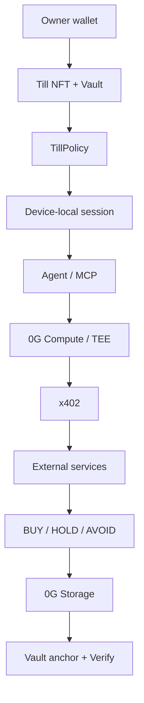

# Till

**Give an agent a Till. It can buy the work it needs. It cannot empty you.**

A Till is a permissioned spend account on **0G Aristotle (chain ID 16661)**. An autonomous agent uses it to buy paid work. The owner never hands over their wallet.

- App: https://till-0g.vercel.app
- Docs: https://till-0g.vercel.app/developers
- API: https://till-api.onrender.com
- MCP: https://till-api.onrender.com/mcp
- GitHub: https://github.com/Mr-Ben-dev/Till
- SDK: [`till-0g-sdk@0.1.0`](https://www.npmjs.com/package/till-0g-sdk)
- MCP stdio: [`till-0g-mcp@0.1.0`](https://www.npmjs.com/package/till-0g-mcp)

No shared operator wallet. No mock TEE. No OpenAI/Groq fallback. No DA fake.

## Why Till

An agent that can finish work needs money: x402 APIs, 0G Compute, storage. Giving it the owner key is how people get emptied.

Till separates **owner authority** from **session authority**. You mint a Till, set a protection policy, fund it, and authorize a device-local session. The session can prove approved work. It cannot withdraw, change policy, or spend another Till.

## Before You Pay

Flagship mission:

1. You paste a token, contract, or protocol.
2. The agent selects live x402 intelligence (Safety · Market · Contract).
3. It quotes under the **$0.50 USDC.e** application cap.
4. 0G Compute (`glm-5.2` TeeML) binds the policy digest (`processResponse`).
5. Private synthesis (`0gm-1.0-35b-a3b`) returns **BUY / HOLD / AVOID**.
6. Encrypted packet lands on 0G Storage and is `anchorPacket`'d on the vault.
7. You verify on [ChainScan](https://chainscan.0g.ai) and `/verify`.

Recorded Aristotle mission (2026-08-20): **$0.016 spent**, **$0.50 cap**, **3 paid checks**, verdict **AVOID**, session-key storage proof.

## How it works



Owner signs: connect, mint, fund, policy, authorize, gas, revoke, withdraw, pause, `setTillTeeSigner`.

Autonomous path: session key signs `vault.anchorPacket` only when the grant is authorized **and** session gas &gt; 0. The UI does not call that mode autonomous if gas is zero.

x402 USDC.e purchases settle on the Herald rail from the API. That is not the session key and not the owner key.

## Security model

| Actor | Can | Cannot |
|---|---|---|
| Owner | Mint, fund, policy, authorize, revoke, withdraw, pause | Be impersonated by MCP |
| Session | Anchor approved proof on this Till | Withdraw, set policy, spend another Till |
| MCP JWT | Read / quote; execute only if session READY | Receive any private key |
| Backend | Herald USDC.e, Compute billing | Owner or session private keys |

Cross-Till isolation is on-chain. Pause and expiry stop spend. Revoke is an owner signature in the app. MCP `till_revoke_session` does not sign; it returns `/agents`.

## 0G integrations

| Piece | What | Why | Live evidence |
|---|---|---|---|
| Aristotle 16661 | Execution chain | Production must be Mainnet | [`GET /health`](https://till-api.onrender.com/health) `{chainId:"16661",simulate:false}` |
| Compute | Router catalog, Payment Layer | Private policy + brief | 29 models · fast=`glm-5.2` · default=`0gm-1.0-35b-a3b` |
| TEE | `processResponse` bind | Digest must match TillVerifier | Recorded glm-5.2 TeeML |
| Storage | Encrypted packet + Flow | Durable evidence | [flow](https://chainscan.0g.ai/tx/0x4ea0b7938003b35dfa13f4865289da130a36686ae6f56acebcbd8939d05bccd0) · [anchor](https://chainscan.0g.ai/tx/0xefbe1b3d29564f19bed969d4737f9182fd80f30553f80acc09adb5617a0a5415) |
| ERC-7857 | `authorizeUsage` | Grant without shipping a key | IERC721 / IERC7857 / Authorize / Cloneable **true** on the NFT |
| ERC-8004 | Identity + Reputation | Agent identity, feedback | [register](https://chainscan.0g.ai/tx/0x6446a6c24a28b23088ef36d92309a3aefbe58b7264da88ae691cb374358ff33a) |
| x402 | Discovery, quote, USDC.e settle | Buy work under policy | [AgentToll](https://chainscan.0g.ai/tx/0x58731e432ae12ba2ed3d428fe834d40c28c838cf599ea87aa254d4091b1a37a1) |

Payment Layer `0xA3b15Bd2aD18BFB6b5f92D8AA9F444Dd59d1cE32` bills **Compute only**. It does not hold Till user funds.

## x402

Live sellers are quoted at run time. Unavailable sellers stay **UNAVAILABLE** (not faked). Settlement asset is **USDC.e** on 16661 (`0x1f3aa82227281ca364bfb3d253b0f1af1da6473e`) via Herald. Swap: https://hub.0g.ai/swap?network=mainnet

Foreign-network 402s (e.g. Base USDC) are skipped.

## MCP

- **Remote:** Streamable HTTP `POST https://till-api.onrender.com/mcp` (JSON-RPC, protocol 2025-11-25)
- **Local:** `npx -y till-0g-mcp` (newline-delimited JSON-RPC). Env: `TILL_ACCESS_TOKEN`, `TILL_API_URL`
- **Auth:** OAuth 2.1 + PKCE, RFC 9728 resource metadata, Bearer header only. Tokens expire in **1 hour**. Never put a token in this README.
- **Forbidden:** private keys, `DEPLOYER_PRIVATE_KEY`, query-string tokens

Cursor (`.cursor/mcp.json` or `~/.cursor/mcp.json`):

```json
{
  "mcpServers": {
    "till": {
      "url": "https://till-api.onrender.com/mcp"
    }
  }
}
```

Then create a scoped token at https://till-0g.vercel.app/developers/mcp (owner `personal_sign`). Do not commit it.

Claude Code:

```bash
claude mcp add --transport http till https://till-api.onrender.com/mcp
claude mcp add --transport stdio till --env TILL_ACCESS_TOKEN=YOUR_TOKEN -- npx -y till-0g-mcp
```

Tools: `till_list` `till_get` `till_get_policy` `till_create_mission` `till_quote_mission` `till_run_mission` `till_get_mission` `till_get_activity` `till_get_proof` `till_get_session` `till_revoke_session`

`till_run_mission` requires scope `till.mission.execute` **and** on-chain session status **READY**. Otherwise: *Autonomous execution is not enabled for this Till.* MCP does not fake Storage anchor.

Default scopes: `till.read` `till.policy.read` `till.mission.create` `till.activity.read` `till.proof.read` `till.session.read`. Optional execute: `till.mission.execute`. High-risk, not silent: `till.policy.write` `till.session.revoke` `till.withdraw`.

## SDK

```bash
npm install till-0g-sdk
```

```ts
import { createClient } from 'till-0g-sdk'
const till = createClient({
  apiUrl: 'https://till-api.onrender.com',
  token: process.env.TILL_ACCESS_TOKEN,
})
await till.listTills()
await till.getPolicy()
await till.quoteMission('Should I deposit into this protocol? 0x833589fCD6eDb6E08f4c7C32D4f71b54bdA02913')
await till.getSession()
```

`createClient` rejects private keys and empty tokens. Mint stays in the app. Examples: `packages/client/examples` (01-connect … 07-mcp).

## Production contracts (Aristotle 16661)

v3 only. Explorer: https://chainscan.0g.ai

| Contract | Address | Create tx |
|---|---|---|
| TillAgentNFT | [`0x730e7c02…01bF`](https://chainscan.0g.ai/address/0x730e7c02D1C238D98aD38AFED98a7CBA980901bF) | [`0x59f24f1e…`](https://chainscan.0g.ai/tx/0x59f24f1e56504ed93b1fdc2b7901c7db56bed4011a9d13ace8e8f1d4a4b75db0) |
| TillPolicy | [`0xBf05e322…9f7c`](https://chainscan.0g.ai/address/0xBf05e322e3C3047089e9Dd9E10Bd8ee320149f7c) | [`0x86e6ade3…`](https://chainscan.0g.ai/tx/0x86e6ade3764913aa19de4f28aa14ab5b650f9c2eb5699d41bb93a1f978fa47cb) |
| TillVerifier | [`0x4C8bed5E…A7f1`](https://chainscan.0g.ai/address/0x4C8bed5Ec7e1F0c0CC7a7Ef141370dd9f4e1A7f1) | [`0xd9fc3e4e…`](https://chainscan.0g.ai/tx/0xd9fc3e4e50ebff47791bbec6cd981b79c757c82837ca0e35c1a64dbfcd8f05a1) |
| TillVault | [`0x2eD09745…d4cB`](https://chainscan.0g.ai/address/0x2eD09745E5Ca4BdeaBc93aB3aab65781B03Ed4cB) | [`0xc7be3972…`](https://chainscan.0g.ai/tx/0xc7be3972506842a8794307bbee4f8d41999dce4cef56dce8334ad86e051fab5d) |
| TillJobEscrow | [`0x1BB730Ff…9de9`](https://chainscan.0g.ai/address/0x1BB730Ff8A4Ff93dE9eDD54B178C0Bc9ddE99de9) | [`0xe801cb7f…`](https://chainscan.0g.ai/tx/0xe801cb7f12dba2b34ef47227a805b3993111900449c6d9f58d6cb62ab0452c42) |

Live `supportsInterface` on TillAgentNFT (Foundation IDs, not stale Till IDs):

| ID | Interface | Result |
|---|---|---|
| `0x80ac58cd` | IERC721 | true |
| `0x2afbede9` | IERC7857 | true |
| `0xdf597d99` | IERC7857Authorize | true |
| `0x74f8628b` | IERC7857Cloneable | true |
| `0xf9a82da5` | old Till IERC7857 | **false** |

JSON: `packages/contracts/deployments/16661.json`

## Proofs (selected, 2026-08-20 v3)

| Event | Tx |
|---|---|
| Till #2 mint | [`0x02b13836…`](https://chainscan.0g.ai/tx/0x02b138362ded4b4930a55c3ab96eee9521b0eec009c90824cb0beb22326472d6) |
| Fund 0.02 0G | [`0x8fb641a8…`](https://chainscan.0g.ai/tx/0x8fb641a85bdfe99a222399fbe25843c0bbdd2ad69b8f3063428997aabe3073d5) |
| AgentToll $0.003 | [`0x58731e43…`](https://chainscan.0g.ai/tx/0x58731e432ae12ba2ed3d428fe834d40c28c838cf599ea87aa254d4091b1a37a1) |
| api402x $0.003 | [`0x3994a707…`](https://chainscan.0g.ai/tx/0x3994a707a4c370a45fa98f39261c3ce1560af62656b45eda4ec64959b52315e3) |
| token-risk $0.010 | [`0x637d9ca7…`](https://chainscan.0g.ai/tx/0x637d9ca7d4ecf39bb256ee0aae0d62be9ea4cb4e4ca857499e9e3da916c4679f) |
| Storage flow | [`0x4ea0b793…`](https://chainscan.0g.ai/tx/0x4ea0b7938003b35dfa13f4865289da130a36686ae6f56acebcbd8939d05bccd0) |
| Vault anchor | [`0xefbe1b3d…`](https://chainscan.0g.ai/tx/0xefbe1b3d29564f19bed969d4737f9182fd80f30553f80acc09adb5617a0a5415) |
| Session-key anchor | [`0x3ed197be…`](https://chainscan.0g.ai/tx/0x3ed197be21fd587954821f1e36c9387e53833e9108ab2ec0ebcca3a7c0380fd1) |

Over-budget $5 vs $0.50: **BLOCKED, $0 spent**. `/verify` reconstructs USDC.e and optional session cache. Job settle / refund proofs: [settle](https://chainscan.0g.ai/tx/0x50b1052fb6aa6b133d013f631f584867a6d14fdc685bc789f9ff9ba84666bbdc) · [refund](https://chainscan.0g.ai/tx/0x3695d0ffb906e4c3d82bd3a610276ba738bfca214113ce6b1f2b1117c6e60bad).

## Tests

Last recorded contract run **2026-08-20**: Foundry **69/69** (unit + fuzz 256 + invariant 64×1280 + reentrancy). IDs from vendored `0g-agentic-id` `type(I).interfaceId`.

Also recorded: `e2e:local` PASS · `e2e:compute` PASS · `e2e:mainnet` PASS (v2 historical + v3 Chrome) · `e2e:settle` PASS · `test:mcp` PASS · `web:build` PASS · MCP initialize **2025-11-25** · private-key POST **400** · tools/list without Bearer **401**.

This documentation pass did not have `forge` on PATH; the 69/69 figure is not invented — it is the last recorded result. Re-run `npm run test:contracts` to refresh.

## Status

| Component | Status | Evidence |
|---|---|---|
| 0G Chain | LIVE | [health](https://till-api.onrender.com/health) |
| ERC-7857 | VERIFIED | interface table above |
| 0G Compute | LIVE | 29 models, glm-5.2 / 0gm-1.0-35b-a3b |
| TEE | VERIFIED | processResponse on recorded missions |
| x402 | LIVE | three paid txs above |
| 0G Storage | LIVE | flow + anchor |
| ERC-8004 | LIVE Identity+Reputation | register tx; Validation Registry **absent** |
| MCP | LIVE | protocol tests + `/developers/mcp` |
| SDK | LIVE | npm 0.1.0 |
| Session | LIVE | session-key anchor |
| Verify | LIVE | https://till-0g.vercel.app/verify |

## Limitations

- **DA** — DAEntrance has no code on 16661. Not used. Not faked.
- **Foundation sealed iTransfer / AgenticID attestor** — not claimed. `iTransferFrom` reverts on Till.
- **ERC-8004 Validation Registry** — not deployed on 0G.
- **x402** — Before You Pay pays USDC.e on 16661 only. Other networks/assets are skipped.
- **MCP** — no session private key, so no Storage anchor from MCP; revoke is owner-wallet.
- **OAuth DCR** — in-memory on Render; use a signed token from `/developers/mcp` after a dyno restart.
- **MetaMask** — Blockaid currently BLOCKs `till-0g.vercel.app`. Confirm the URL. Custom domain is the durable fix. Privy app should be **Production**.

Galileo 16602 is rehearsal only.

## Run locally

```bash
cp .env.example .env
npm install
npm run api
npm run web
```

Never put `sk-`, `mk-`, or private keys in `VITE_*`.

## License

MIT
