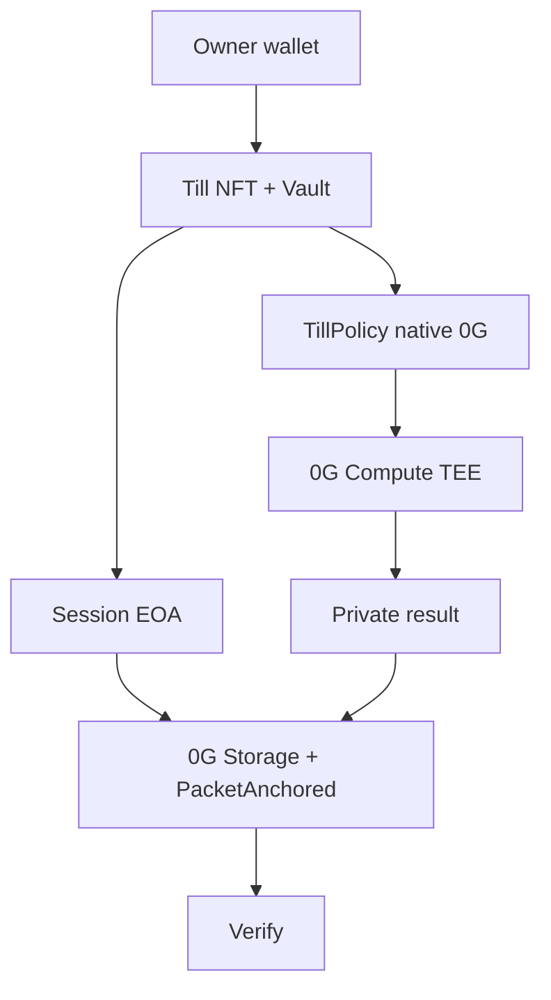

# Till

**Tell your agent what you need done. Give it a bounded Till. It finishes the work. You get the result and proof.**

A Till is a permissioned **agent work account** on **0G Aristotle (chain ID 16661)**. Native 0G sits in a vault under **TillPolicy**. The owner never hands over their wallet.

- App: https://till-0g.vercel.app
- Docs: https://till-0g.vercel.app/developers
- API: https://till-api.onrender.com
- MCP: https://till-api.onrender.com/mcp
- GitHub: https://github.com/Mr-Ben-dev/Till
- SDK: [`till-0g-sdk@0.1.0`](https://www.npmjs.com/package/till-0g-sdk)
- MCP stdio: [`till-0g-mcp@0.1.0`](https://www.npmjs.com/package/till-0g-mcp)

No mock TEE. No OpenAI/Groq fallback. No DA fake. No invented x402 sellers.

## Why Till

An agent that can finish work needs a bounded account: 0G Compute, storage gas, policy. Giving it the owner key is how people get emptied.

Till separates **owner authority** from **session authority**. You mint a Till, set a native-0G protection policy, fund the vault, and authorize a device-local session. The session finishes allowed work and anchors proof. It cannot withdraw vault 0G, change policy, or spend another Till.

## Product

Work Desk is the product.

`WHAT DO YOU NEED DONE? → PLAN → POLICY → PRIVATE COMPUTE → TEE → RESULT → STORAGE → PROOF`

The result is primary. Proof is secondary. Hashes are tertiary.

A new Till: CREATE → PROTECT → FUND → ENABLE AGENT → FIRST WORK. A LIVE Till: Start work.

## Four work families

1. **Investigate** — address / token / protocol. Public Aristotle RPC facts + private 0G Compute. Not a paid scanner.
2. **Review** — Solidity / ABI / diff / contract. AI-assisted — **not a certified audit**.
3. **Research** — private structured brief. Not a chatbot.
4. **Compare** — two addresses or artifacts. Differences, not a scoreboard.

Copilot at compile time may ask one clarifying question. It is not a chat product.

## Why 0G

- **0G** is the engine: Till NFT + Policy + Compute TEE attestation + Storage + ERC-7857 + ERC-8004 Identity/Reputation + optional vault Jobs (`TillVerifier`).
- **Payment Layer** `0xA3b15Bd2aD18BFB6b5f92D8AA9F444Dd59d1cE32` bills **0G Compute tokens for the operator Router key**. That is **not** TillVault. Do not claim “this Till paid Compute” unless a vault `Released` event exists.
- **Session native 0G** on Work Desk is spent as **Storage gas + PacketAnchored**.

## Optional x402 (not the product)

x402 remains in the codebase under **optional external work**.

- 227 x402-list services scanned (2026-08-22) → **zero** native `eip155:16661` accepts.
- Herald **facilitator** Exact on 16661 **works**. Operator inbound [`0xee6a0c2b…`](https://chainscan.0g.ai/tx/0xee6a0c2bab9749c9d425d843b8308016d179067c9f13470d0698fd3bfb51b131) is **not** session SKU 200 proof.
- Herald **router** dest-settlement of Base sellers **does not work**. Till will **not** facilitator-settle then pretend the SKU succeeded.
- APP session `Transfer.from == session` + seller HTTP 200 is **not live**.

Quoted ≠ settled. Catalog/README/x402-list is not settlement proof.

## Money architecture

| Rail | Asset | Gate | Signer (APP) |
|---|---|---|---|
| Vault | native 0G | **On-chain TillPolicy** | owner / session for lock-release Jobs |
| Work Desk Compute | 0G Compute tokens | live TeeML catalog | **operator Payment Layer** (labeled) |
| Work Desk proof | native 0G gas | READY session | **session EOA** `anchorPacket` |
| Optional x402 | USDC.e | quote + $0.50 hard max + pause/expiry/revoke **API fail-closed** | **session EOA EIP-3009** (blocked: no 16661 seller) |

APP Work Desk never uses `DEPLOYER_PRIVATE_KEY` for session Storage. MCP `till_run_mission` is a **labeled operator Compute rail** and cannot Storage-anchor.

## App

Top navigation: **Home · Tills · Activity · Developers**. Context tabs: Overview · Policy · Agent · Work · Activity · Proof. Jobs are not on the primary Till nav.

| Route | Job |
|---|---|
| `/` | Marketing |
| `/tills` | Your work accounts |
| `/tills/new` | Create wizard |
| `/till` | Overview |
| `/till/policy` | Native 0G protection |
| `/till/agent` | Session |
| `/till/mission` | Work Desk |
| `/jobs` | Advanced escrow (hidden from primary nav) |
| `/activity` | Proof timeline |
| `/verify` | Paste a tx hash — no wallet |
| `/developers` | Docs |

## AUTO models

`GET https://router-api.0g.ai/v1/models` is re-queried via `GET /v1/models/live`. AUTO is not a frozen 29-model list. Spend/security ALLOW requires TeeML + JSON (+ tools). `verifiability=None` models cannot ALLOW. No OpenAI/Groq fallback. If the required model disappears, fail closed.

UX: **AUTO first**. Choose model second (CHEAP / FAST / DEEP / PRIVATE from the live catalog). CUSTOM unverified models are blocked for ALLOW.

Presets: AUTO (default), CHEAP, FAST, DEEP, PRIVATE.

0G Compute `processResponse` is **not** the same as `TillVerifier.verifyAllow` (that path is Jobs lock).



Owner signs: connect, mint, fund vault 0G, policy, authorize, gas, revoke, withdraw, pause, `setTillTeeSigner`.

APP Work Desk: session EOA signs Storage/anchor only. No MetaMask during READY autonomous work. Compute tokens bill the operator Payment Layer.

MCP `till_run_mission` is operator Compute and labeled. It is not the APP session rail.

## Privacy (claimed only where true)

| What | Where it goes |
|---|---|
| Request text / pasted artifact | Till API, then 0G Router model |
| Public `0x` facts | Aristotle RPC (public) |
| Model output | Encrypted 0G Storage packet (backend holds AES key today) |
| On-chain | Storage root + PacketAnchored digest. Not the full brief |
| External sellers | **Not** called on Work Desk |

Prompts are **not** “never leave the browser.” TEE `processResponse` is claimed only when the Router returns it.

## Security model

| Actor | Can | Cannot |
|---|---|---|
| Owner | Mint, fund 0G, policy, authorize, revoke, withdraw, pause | Be impersonated by MCP |
| Session | `anchorPacket` when gas &gt; 0; optional EIP-3009 if a real 16661 SKU exists | Withdraw vault 0G, set policy, spend another Till |
| MCP JWT | Read / compile; execute only as labeled operator Compute | Receive any private key; Storage-anchor |
| Backend APP | Forward Compute; never owner key | Pretend Payment Layer = TillVault |

Cross-Till isolation is on-chain. Pause and expiry stop spend. Revoke is an owner signature in the app. MCP `till_revoke_session` does not sign; it returns `/till/agent`.

## 0G integrations

| Piece | What | Why | Live evidence |
|---|---|---|---|
| Aristotle 16661 | Execution chain | Production must be Mainnet | [`GET /health`](https://till-api.onrender.com/health) `{chainId:"16661",simulate:false}` |
| Compute | Router catalog, Payment Layer | Private policy + brief | Live catalog via `/v1/models/live` · AUTO spend role TeeML+JSON (`glm-5.2` as of 2026-08-22) |
| TEE | `processResponse` bind | Digest must match | Recorded glm-5.2 TeeML |
| Storage | Encrypted packet + Flow | Durable evidence | [flow](https://chainscan.0g.ai/tx/0x4ea0b7938003b35dfa13f4865289da130a36686ae6f56acebcbd8939d05bccd0) · [anchor](https://chainscan.0g.ai/tx/0xefbe1b3d29564f19bed969d4737f9182fd80f30553f80acc09adb5617a0a5415) |
| ERC-7857 | `authorizeUsage` | Grant without shipping a key | IERC721 / IERC7857 / Authorize / Cloneable **true** on the NFT |
| ERC-8004 | Identity + Reputation | Agent identity, feedback | [register](https://chainscan.0g.ai/tx/0x6446a6c24a28b23088ef36d92309a3aefbe58b7264da88ae691cb374358ff33a) |
| Optional x402 | Discovery only until a 16661 seller 200 exists | External work | Facilitator Exact [tx](https://chainscan.0g.ai/tx/0xee6a0c2bab9749c9d425d843b8308016d179067c9f13470d0698fd3bfb51b131) (operator inbound, **not** session proof). Router dest-proxy **blocked**. |

Payment Layer bills **Compute only**. It does not hold Till user funds.

## MCP

- **Remote:** Streamable HTTP `POST https://till-api.onrender.com/mcp` (JSON-RPC, protocol 2025-11-25)
- **Local:** `npx -y till-0g-mcp` (newline-delimited JSON-RPC). Env: `TILL_ACCESS_TOKEN`, `TILL_API_URL`
- **Auth:** OAuth 2.1 + PKCE, RFC 9728 resource metadata, Bearer header only. Tokens expire in **1 hour**. Never put a token in this README.
- **Forbidden:** private keys, `DEPLOYER_PRIVATE_KEY`, query-string tokens

Cursor (`.cursor/mcp.json` or `~/.cursor/mcp.json`):

```json
{
  "mcpServers": {
    "till": {
      "url": "https://till-api.onrender.com/mcp"
    }
  }
}
```

Then create a scoped token at https://till-0g.vercel.app/developers/mcp (owner `personal_sign`). Do not commit it.

Claude Code:

```bash
claude mcp add --transport http till https://till-api.onrender.com/mcp
claude mcp add --transport stdio till --env TILL_ACCESS_TOKEN=YOUR_TOKEN -- npx -y till-0g-mcp
```

Tools: `till_list` `till_get` `till_get_policy` `till_create_mission` `till_quote_mission` `till_run_mission` `till_get_mission` `till_get_activity` `till_get_proof` `till_get_session` `till_revoke_session`

`till_run_mission` requires scope `till.mission.execute`. It is the **operator Compute rail** (not the browser session). MCP never receives a session private key, so it cannot Storage-anchor. `till_review` and `till_get_result` are also available.

Default scopes: `till.read` `till.policy.read` `till.mission.create` `till.activity.read` `till.proof.read` `till.session.read`. Optional execute: `till.mission.execute`. High-risk, not silent: `till.policy.write` `till.session.revoke` `till.withdraw`.

## SDK

```bash
npm install till-0g-sdk
```

```ts
import { createClient } from 'till-0g-sdk'
const till = createClient({
  apiUrl: 'https://till-api.onrender.com',
  token: process.env.TILL_ACCESS_TOKEN,
})
await till.listTills()
await till.getPolicy()
await till.quoteMission('Investigate this contract. 0x833589fCD6eDb6E08f4c7C32D4f71b54bdA02913')
await till.getSession()
```

`createClient` rejects private keys and empty tokens. Mint stays in the app. Examples: `packages/client/examples` (01-connect … 07-mcp).

## Production contracts (Aristotle 16661)

v3 only. Explorer: https://chainscan.0g.ai

| Contract | Address | Create tx |
|---|---|---|
| TillAgentNFT | [`0x730e7c02…01bF`](https://chainscan.0g.ai/address/0x730e7c02D1C238D98aD38AFED98a7CBA980901bF) | [`0x59f24f1e…`](https://chainscan.0g.ai/tx/0x59f24f1e56504ed93b1fdc2b7901c7db56bed4011a9d13ace8e8f1d4a4b75db0) |
| TillPolicy | [`0xBf05e322…9f7c`](https://chainscan.0g.ai/address/0xBf05e322e3C3047089e9Dd9E10Bd8ee320149f7c) | [`0x86e6ade3…`](https://chainscan.0g.ai/tx/0x86e6ade3764913aa19de4f28aa14ab5b650f9c2eb5699d41bb93a1f978fa47cb) |
| TillVerifier | [`0x4C8bed5E…A7f1`](https://chainscan.0g.ai/address/0x4C8bed5Ec7e1F0c0CC7a7Ef141370dd9f4e1A7f1) | [`0xd9fc3e4e…`](https://chainscan.0g.ai/tx/0xd9fc3e4e50ebff47791bbec6cd981b79c757c82837ca0e35c1a64dbfcd8f05a1) |
| TillVault | [`0x2eD09745…d4cB`](https://chainscan.0g.ai/address/0x2eD09745E5Ca4BdeaBc93aB3aab65781B03Ed4cB) | [`0xc7be3972…`](https://chainscan.0g.ai/tx/0xc7be3972506842a8794307bbee4f8d41999dce4cef56dce8334ad86e051fab5d) |
| TillJobEscrow | [`0x1BB730Ff…9de9`](https://chainscan.0g.ai/address/0x1BB730Ff8A4Ff93dE9eDD54B178C0Bc9ddE99de9) | [`0xe801cb7f…`](https://chainscan.0g.ai/tx/0xe801cb7f12dba2b34ef47227a805b3993111900449c6d9f58d6cb62ab0452c42) |

Live `supportsInterface` on TillAgentNFT (Foundation IDs, not stale Till IDs):

| ID | Interface | Result |
|---|---|---|
| `0x80ac58cd` | IERC721 | true |
| `0x2afbede9` | IERC7857 | true |
| `0xdf597d99` | IERC7857Authorize | true |
| `0x74f8628b` | IERC7857Cloneable | true |
| `0xf9a82da5` | old Till IERC7857 | **false** |

JSON: `packages/contracts/deployments/16661.json`

No contract change in this product pivot. v3 already supports Work Desk.

## Proofs (selected)

| Event | Tx |
|---|---|
| Till #2 mint | [`0x02b13836…`](https://chainscan.0g.ai/tx/0x02b138362ded4b4930a55c3ab96eee9521b0eec009c90824cb0beb22326472d6) |
| Fund 0.02 0G | [`0x8fb641a8…`](https://chainscan.0g.ai/tx/0x8fb641a85bdfe99a222399fbe25843c0bbdd2ad69b8f3063428997aabe3073d5) |
| Storage flow | [`0x4ea0b793…`](https://chainscan.0g.ai/tx/0x4ea0b7938003b35dfa13f4865289da130a36686ae6f56acebcbd8939d05bccd0) |
| Vault anchor | [`0xefbe1b3d…`](https://chainscan.0g.ai/tx/0xefbe1b3d29564f19bed969d4737f9182fd80f30553f80acc09adb5617a0a5415) |
| Session-key Investigate Work Desk (Till 2, 2026-08-22) | [`0x494a2341…`](https://chainscan.0g.ai/tx/0x494a23418750b795ef8070240f0d8bb416b29f7f2f8ffd7613265101f5cbeb50) |
| Session-key Review Work Desk (Till 2, 2026-08-22) | [`0x34be2264…`](https://chainscan.0g.ai/tx/0x34be22641171b57c197408461ded8e7bf8328771ca285292b2bfafe36f1d6403) |
| Herald facilitator Exact (operator inbound 0.003, **not** session SKU 200) | [`0xee6a0c2b…`](https://chainscan.0g.ai/tx/0xee6a0c2bab9749c9d425d843b8308016d179067c9f13470d0698fd3bfb51b131) |

Over-budget 5 0G vs policy: **BLOCKED, 0 moved**. `/verify` reconstructs the storage packet from the anchor tx. Job settle / refund proofs: [settle](https://chainscan.0g.ai/tx/0x50b1052fb6aa6b133d013f631f584867a6d14fdc685bc789f9ff9ba84666bbdc) · [refund](https://chainscan.0g.ai/tx/0x3695d0ffb906e4c3d82bd3a610276ba738bfca214113ce6b1f2b1117c6e60bad).

## Tests

This session (2026-08-22 Work Desk pivot, SHA `d205d0cef8469a2042f81a1ee60cb73d8845d161` then follow-up copy SHA):

- Foundry **69/69** (unit + fuzz 256 + invariant 64×1280 + reentrancy)
- API unit: compiler + mcp-auth + x402Herald.resource **13/13**
- `web:build` **PASS**
- Production `/health` `{ok:true,chainId:"16661",simulate:false}`
- Production `/v1/models/live` 29 models, AUTO spend `glm-5.2`, `needsProcurement=false`
- Chrome Till 2 READY Autonomous Work Desk:
  - Over-budget **5 0G requested · 0 moved** (vault still 0.019 0G)
  - Investigate `0x8335…` → **CAUTION**, `glm-5.2 processResponse=true`, TEE VERIFIED, Storage+Proof, **no MetaMask**
  - Review NaiveVault → **ISSUES** (`rescue()` drain), TEE VERIFIED, Storage+Proof, **no MetaMask**
  - `/verify` reconstructs Investigate PacketAnchored + durable brief, `from` = session `0x06d47E…052f`, **no USDC.e**
- Home hero is Work Desk. x402 labeled optional / not the product.

F1 x402 session settlement remains **FAIL / NO-GO**. That is acceptable. Work Desk does not require it.

Pause / resume / revoke / Till-switch fail-closed / Jobs lock were **not** re-run this hour. Do not claim them.

## Limitations

- **Payment Layer ≠ TillVault.** Compute tokens are operator-billed. Session gas is the user-visible native 0G spend on Work Desk.
- **x402 is optional and currently unavailable** for Aristotle-payable SKUs. F1 session settlement remains FAIL / NO-GO.
- **Recorded 2026-08-20 x402 txs** (`0x58731e43…`, `0x3994a707…`, `0x637d9ca7…`) were paid from `0x220f…` (operator coincidence). Do not treat them as session-drawer proof.
- **DA** — DAEntrance has no code on 16661. Not used. Not faked.
- **Foundation sealed iTransfer / AgenticID attestor** — not claimed. `iTransferFrom` reverts on Till.
- **ERC-8004 Validation Registry** — not deployed on 0G.
- **Render receipt file** — durable JSON on disk. Without a persistent disk, a Render dyno restart can drop in-API receipts; on-chain txs remain. `/verify` still reads Aristotle.
- **OAuth DCR** — in-memory on Render; use a signed token from `/developers/mcp` after a dyno restart.
- **MetaMask** — Blockaid currently BLOCKs `till-0g.vercel.app`. Confirm the URL. Custom domain is the durable fix.
- Work is **not** “on-chain TEE.” Compute attestation is `processResponse`. TillVerifier Work is the Jobs path.
- Review is **not** a certified audit.

Galileo 16602 is rehearsal only.

## Run locally

```bash
cp .env.example .env
npm install
npm run api
npm run web
```

Never put `sk-`, `mk-`, or private keys in `VITE_*`.

## License

MIT
