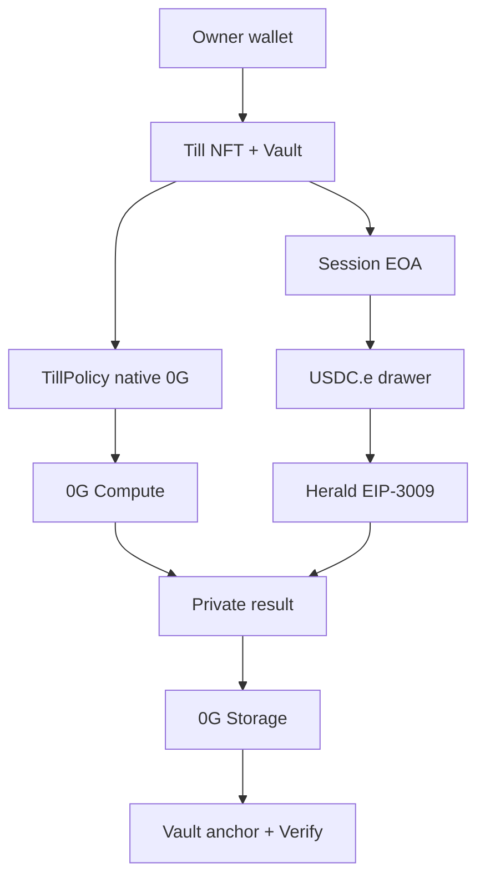

# Till

**Tell your agent what you need done. It buys the work it needs. You get the result. You never hand it your wallet.**

A Till is a permissioned spend account on **0G Aristotle (chain ID 16661)**. Native 0G sits in a vault under **TillPolicy**. USDC.e for x402 sits in a **per-mission session drawer** and is spent with **EIP-3009** from the authorized session EOA. The owner never hands over their wallet.

- App: https://till-0g.vercel.app
- Docs: https://till-0g.vercel.app/developers
- API: https://till-api.onrender.com
- MCP: https://till-api.onrender.com/mcp
- GitHub: https://github.com/Mr-Ben-dev/Till
- SDK: [`till-0g-sdk@0.1.0`](https://www.npmjs.com/package/till-0g-sdk)
- MCP stdio: [`till-0g-mcp@0.1.0`](https://www.npmjs.com/package/till-0g-mcp)

No shared operator wallet on the APP path. No mock TEE. No OpenAI/Groq fallback. No DA fake.

## Why Till

An agent that can finish work needs money: x402 APIs, 0G Compute, storage. Giving it the owner key is how people get emptied.

Till separates **owner authority** from **session authority**. You mint a Till, set a native-0G protection policy, fund the vault, and authorize a device-local session. The session can prove approved work and sign USDC.e EIP-3009 for the current mission quote. It cannot withdraw vault 0G, change policy, or spend another Till.

## User journey

`REQUEST → COMPILE → PLAN → QUOTE → APPROVE → EXECUTE → RESULT → PROOF`

The result is primary. Proof is secondary. Hashes are tertiary.

A new Till: CREATE → PROTECT → FUND → ENABLE AGENT → FIRST MISSION. A LIVE Till: Mission ready.

## Four mission families

1. **Before You Pay** — token/protocol/contract. **No live Aristotle-payable x402 SKU** as of 2026-08-22 (227 x402-list services scanned; zero `eip155:16661` accepts). Herald facilitator Exact on 16661 works. Herald router dest-settlement of Base sellers does not. Till fail-closes.
2. **Before You Trust** — public on-chain facts + Compute. Paid wallet-risk SKUs stay quoted until a new settlement tx exists.
3. **Research For Me** — 0G Compute private brief. x402 optional and only if SETTLED.
4. **Review This** — Solidity/ABI/diff/on-chain target. AI-assisted review — **not a certified audit**.

Quoted ≠ settled. Catalog/README/x402-list is not settlement proof.

## Why 0G / why x402 / why the session drawer

- **0G** is the engine: Till NFT + Policy + Compute attestation + Storage + optional vault Work path (`TillVerifier`) for Jobs.
- **x402** buys specialist facts. Settlement is Aristotle USDC.e via Herald. Seller data may describe Base.
- **Session drawer** exists because Bridged USDC.e has EIP-3009 and **no EIP-1271**, so a TillVault contract cannot be `Transfer.from`. Herald Exact recovers an EOA. USDC.e is **not** TillPolicy-controlled.

## Money architecture

| Rail | Asset | Gate | Signer (APP) |
|---|---|---|---|
| Vault | native 0G | **On-chain TillPolicy** | owner / session for lock-release Jobs |
| Session drawer | USDC.e | quote + $0.50 hard max + pause/expiry/revoke **API fail-closed** | **session EOA EIP-3009** |

APP missions must never use `DEPLOYER_PRIVATE_KEY`. MCP `till_run_mission` is a **labeled operator rail**.

After a mission, leftover USDC.e is swept to the owner **before** revoke. Revoke does not claw back USDC.e.

## App

Top navigation: **Home · Tills · Activity · Developers**. Context tabs: Overview · Policy · Agent · Mission · Activity · Proof. Jobs/Work are not on the primary Till nav.

| Route | Job |
|---|---|
| `/` | Marketing |
| `/tills` | Your spending accounts |
| `/tills/new` | Create wizard |
| `/till` | Overview |
| `/till/policy` | Native 0G protection |
| `/till/agent` | Session |
| `/till/mission` | Mission Desk |
| `/jobs` | Advanced escrow (hidden from primary nav) |
| `/activity` | Proof timeline |
| `/verify` | Paste a tx hash — no wallet |
| `/developers` | Docs |

## AUTO models

`GET https://router-api.0g.ai/v1/models` is re-queried. AUTO is not a frozen 29-model list. Spend/security ALLOW requires TeeML + JSON (+ tools). `verifiability=None` models cannot ALLOW spend. No OpenAI/Groq fallback. If the required model disappears, fail closed.

Presets: AUTO (default), CHEAP, FAST, DEEP, PRIVATE, CUSTOM (CUSTOM blocked for spend unless TeeML+JSON).

0G Compute `processResponse` is **not** the same as `TillVerifier.verifyAllow` (that path is Jobs lock).



Owner signs: connect, mint, fund vault 0G, policy, authorize, gas, revoke, withdraw, pause, `setTillTeeSigner`, fund session USDC.e.

APP x402: session EOA signs EIP-3009. ChainScan `USDC.e Transfer.from` must equal the session. Operator key is never used on that path.

MCP `till_run_mission` is operator-signed and labeled. It is not the APP session rail.

## Security model

| Actor | Can | Cannot |
|---|---|---|
| Owner | Mint, fund 0G, policy, authorize, revoke, withdraw, pause, fund/sweep drawer | Be impersonated by MCP |
| Session | EIP-3009 for the current quote; `anchorPacket` when gas &gt; 0 | Withdraw vault 0G, set policy, spend another Till |
| MCP JWT | Read / quote; execute only as labeled operator rail | Receive any private key |
| Backend APP settle | Forward session PAYMENT-SIGNATURE | Sign APP USDC.e with deployer |

Cross-Till isolation is on-chain. Pause and expiry stop spend. Revoke is an owner signature in the app. MCP `till_revoke_session` does not sign; it returns `/till/agent`.

## 0G integrations

| Piece | What | Why | Live evidence |
|---|---|---|---|
| Aristotle 16661 | Execution chain | Production must be Mainnet | [`GET /health`](https://till-api.onrender.com/health) `{chainId:"16661",simulate:false}` |
| Compute | Router catalog, Payment Layer | Private policy + brief | 29 models · fast=`glm-5.2` · default=`0gm-1.0-35b-a3b` |
| TEE | `processResponse` bind | Digest must match TillVerifier | Recorded glm-5.2 TeeML |
| Storage | Encrypted packet + Flow | Durable evidence | [flow](https://chainscan.0g.ai/tx/0x4ea0b7938003b35dfa13f4865289da130a36686ae6f56acebcbd8939d05bccd0) · [anchor](https://chainscan.0g.ai/tx/0xefbe1b3d29564f19bed969d4737f9182fd80f30553f80acc09adb5617a0a5415) |
| ERC-7857 | `authorizeUsage` | Grant without shipping a key | IERC721 / IERC7857 / Authorize / Cloneable **true** on the NFT |
| ERC-8004 | Identity + Reputation | Agent identity, feedback | [register](https://chainscan.0g.ai/tx/0x6446a6c24a28b23088ef36d92309a3aefbe58b7264da88ae691cb374358ff33a) |
| x402 | Discovery + quote. Inbound Exact on 16661 via Herald **facilitator** | Buy work under a session EIP-3009 | Facilitator `/settle` [tx](https://chainscan.0g.ai/tx/0xee6a0c2bab9749c9d425d843b8308016d179067c9f13470d0698fd3bfb51b131) (operator inbound 0.003 USDC.e, **not** session proof). **Herald router dest-proxy currently fails** — SKU 200 is blocked. |

Payment Layer `0xA3b15Bd2aD18BFB6b5f92D8AA9F444Dd59d1cE32` bills **Compute only**. It does not hold Till user funds.

## x402

Live sellers are quoted at run time. Unavailable sellers stay **UNAVAILABLE** (not faked). Settlement asset is **USDC.e** on 16661 (`0x1f3aa82227281ca364bfb3d253b0f1af1da6473e`).

Herald **facilitator** `POST /verify` + `POST /settle` on `eip155:16661` Exact **works** (EIP-3009 `transferWithAuthorization`, gas payer `0x686C…`, `Transfer.to` = Herald payTo).

Herald **cross-chain router** `https://router.heraldprotocol.xyz/route/x402` currently **proxies the 16661 `PAYMENT-SIGNATURE` to the destination seller**. Base sellers (AgentToll, etc.) try to settle that signature as Base USDC and revert. wrapFetch therefore returns HTTP 402 with dest-native `eip155:8453` accepts. Till **fail-closes and sweeps** the session drawer. Till will **not** call facilitator `/settle` and then pretend the SKU succeeded — that would move USDC.e to Herald with no seller 200.

APP session `Transfer.from == session` + SKU 200 is **not live** until Herald fixes dest-proxy. Old operator hashes are not session proof.

Swap USDC.e: https://hub.0g.ai/swap?network=mainnet

Foreign-network 402s (e.g. Base USDC as the intended rail) are skipped.

## MCP

- **Remote:** Streamable HTTP `POST https://till-api.onrender.com/mcp` (JSON-RPC, protocol 2025-11-25)
- **Local:** `npx -y till-0g-mcp` (newline-delimited JSON-RPC). Env: `TILL_ACCESS_TOKEN`, `TILL_API_URL`
- **Auth:** OAuth 2.1 + PKCE, RFC 9728 resource metadata, Bearer header only. Tokens expire in **1 hour**. Never put a token in this README.
- **Forbidden:** private keys, `DEPLOYER_PRIVATE_KEY`, query-string tokens

Cursor (`.cursor/mcp.json` or `~/.cursor/mcp.json`):

```json
{
  "mcpServers": {
    "till": {
      "url": "https://till-api.onrender.com/mcp"
    }
  }
}
```

Then create a scoped token at https://till-0g.vercel.app/developers/mcp (owner `personal_sign`). Do not commit it.

Claude Code:

```bash
claude mcp add --transport http till https://till-api.onrender.com/mcp
claude mcp add --transport stdio till --env TILL_ACCESS_TOKEN=YOUR_TOKEN -- npx -y till-0g-mcp
```

Tools: `till_list` `till_get` `till_get_policy` `till_create_mission` `till_quote_mission` `till_run_mission` `till_get_mission` `till_get_activity` `till_get_proof` `till_get_session` `till_revoke_session`

`till_run_mission` requires scope `till.mission.execute`. It is the **operator rail** (not the browser session). MCP never receives a session private key, so it cannot Storage-anchor. `till_review` and `till_get_result` are also available.

Default scopes: `till.read` `till.policy.read` `till.mission.create` `till.activity.read` `till.proof.read` `till.session.read`. Optional execute: `till.mission.execute`. High-risk, not silent: `till.policy.write` `till.session.revoke` `till.withdraw`.

## SDK

```bash
npm install till-0g-sdk
```

```ts
import { createClient } from 'till-0g-sdk'
const till = createClient({
  apiUrl: 'https://till-api.onrender.com',
  token: process.env.TILL_ACCESS_TOKEN,
})
await till.listTills()
await till.getPolicy()
await till.quoteMission('Should I deposit into this protocol? 0x833589fCD6eDb6E08f4c7C32D4f71b54bdA02913')
await till.getSession()
```

`createClient` rejects private keys and empty tokens. Mint stays in the app. Examples: `packages/client/examples` (01-connect … 07-mcp).

## Production contracts (Aristotle 16661)

v3 only. Explorer: https://chainscan.0g.ai

| Contract | Address | Create tx |
|---|---|---|
| TillAgentNFT | [`0x730e7c02…01bF`](https://chainscan.0g.ai/address/0x730e7c02D1C238D98aD38AFED98a7CBA980901bF) | [`0x59f24f1e…`](https://chainscan.0g.ai/tx/0x59f24f1e56504ed93b1fdc2b7901c7db56bed4011a9d13ace8e8f1d4a4b75db0) |
| TillPolicy | [`0xBf05e322…9f7c`](https://chainscan.0g.ai/address/0xBf05e322e3C3047089e9Dd9E10Bd8ee320149f7c) | [`0x86e6ade3…`](https://chainscan.0g.ai/tx/0x86e6ade3764913aa19de4f28aa14ab5b650f9c2eb5699d41bb93a1f978fa47cb) |
| TillVerifier | [`0x4C8bed5E…A7f1`](https://chainscan.0g.ai/address/0x4C8bed5Ec7e1F0c0CC7a7Ef141370dd9f4e1A7f1) | [`0xd9fc3e4e…`](https://chainscan.0g.ai/tx/0xd9fc3e4e50ebff47791bbec6cd981b79c757c82837ca0e35c1a64dbfcd8f05a1) |
| TillVault | [`0x2eD09745…d4cB`](https://chainscan.0g.ai/address/0x2eD09745E5Ca4BdeaBc93aB3aab65781B03Ed4cB) | [`0xc7be3972…`](https://chainscan.0g.ai/tx/0xc7be3972506842a8794307bbee4f8d41999dce4cef56dce8334ad86e051fab5d) |
| TillJobEscrow | [`0x1BB730Ff…9de9`](https://chainscan.0g.ai/address/0x1BB730Ff8A4Ff93dE9eDD54B178C0Bc9ddE99de9) | [`0xe801cb7f…`](https://chainscan.0g.ai/tx/0xe801cb7f12dba2b34ef47227a805b3993111900449c6d9f58d6cb62ab0452c42) |

Live `supportsInterface` on TillAgentNFT (Foundation IDs, not stale Till IDs):

| ID | Interface | Result |
|---|---|---|
| `0x80ac58cd` | IERC721 | true |
| `0x2afbede9` | IERC7857 | true |
| `0xdf597d99` | IERC7857Authorize | true |
| `0x74f8628b` | IERC7857Cloneable | true |
| `0xf9a82da5` | old Till IERC7857 | **false** |

JSON: `packages/contracts/deployments/16661.json`

## Proofs (selected, 2026-08-20 v3)

| Event | Tx |
|---|---|
| Till #2 mint | [`0x02b13836…`](https://chainscan.0g.ai/tx/0x02b138362ded4b4930a55c3ab96eee9521b0eec009c90824cb0beb22326472d6) |
| Fund 0.02 0G | [`0x8fb641a8…`](https://chainscan.0g.ai/tx/0x8fb641a85bdfe99a222399fbe25843c0bbdd2ad69b8f3063428997aabe3073d5) |
| Herald facilitator Exact (operator inbound 0.003, **not** session SKU 200) | [`0xee6a0c2b…`](https://chainscan.0g.ai/tx/0xee6a0c2bab9749c9d425d843b8308016d179067c9f13470d0698fd3bfb51b131) |
| AgentToll / api402x / token-risk (operator coincidence, not session proof) | [`0x58731e43…`](https://chainscan.0g.ai/tx/0x58731e432ae12ba2ed3d428fe834d40c28c838cf599ea87aa254d4091b1a37a1) · [`0x3994a707…`](https://chainscan.0g.ai/tx/0x3994a707a4c370a45fa98f39261c3ce1560af62656b45eda4ec64959b52315e3) · [`0x637d9ca7…`](https://chainscan.0g.ai/tx/0x637d9ca7d4ecf39bb256ee0aae0d62be9ea4cb4e4ca857499e9e3da916c4679f) |
| Storage flow | [`0x4ea0b793…`](https://chainscan.0g.ai/tx/0x4ea0b7938003b35dfa13f4865289da130a36686ae6f56acebcbd8939d05bccd0) |
| Vault anchor | [`0xefbe1b3d…`](https://chainscan.0g.ai/tx/0xefbe1b3d29564f19bed969d4737f9182fd80f30553f80acc09adb5617a0a5415) |
| Session-key anchor | [`0x3ed197be…`](https://chainscan.0g.ai/tx/0x3ed197be21fd587954821f1e36c9387e53833e9108ab2ec0ebcca3a7c0380fd1) |

Over-budget $5 vs $0.50: **BLOCKED, $0 spent**. `/verify` reconstructs USDC.e and optional session cache. Job settle / refund proofs: [settle](https://chainscan.0g.ai/tx/0x50b1052fb6aa6b133d013f631f584867a6d14fdc685bc789f9ff9ba84666bbdc) · [refund](https://chainscan.0g.ai/tx/0x3695d0ffb906e4c3d82bd3a610276ba738bfca214113ce6b1f2b1117c6e60bad).

## Tests

This session (2026-08-22 execution pass):

- Foundry **69/69** (unit + fuzz 256 + invariant 64×1280 + reentrancy) via `%USERPROFILE%\.foundry\bin\forge.exe`
- API unit: compiler + mcp-auth + x402Herald.resource **10/10**
- `web:build` **PASS**
- Chrome: Till switch, policy/agent/activity/verify/jobs/over-budget/home/deep-link ran on production. Policy edit / revoke / F1 seller 200 were not claimed.
- MCP HTTP: 19/20 tool/auth cases (`till_get_proof` wrapper returned empty in the probe). Token created in the real UI.
- SDK: fresh `npm install till-0g-sdk till-0g-mcp` in a temp directory. Imports, `createClient`, empty-token and private-key rejection **PASS**. npm `0.1.0` matches `packages/client`.

Playwright production browser E2E and a new session-signed USDC.e ChainScan `from==session` hash are **not** claimed in this README until they are actually run after deploy.

## Limitations

- **USDC.e is not TillPolicy.** Session drawer + EIP-3009 + APP refuse. Maximum loss if the session key is stolen during a mission is leftover drawer USDC.e (target: one quote) plus session gas.
- **Recorded 2026-08-20 x402 txs** (`0x58731e43…`, `0x3994a707…`, `0x637d9ca7…`) were paid from `0x220f…` (operator coincidence). Do not treat them as session-drawer proof.
- **Quoted SKUs** (OnchainPulse, klymax holders, extra AgentToll routes) are not production-executable until a new settlement tx + regression test.
- **DA** — DAEntrance has no code on 16661. Not used. Not faked.
- **Foundation sealed iTransfer / AgenticID attestor** — not claimed. `iTransferFrom` reverts on Till.
- **ERC-8004 Validation Registry** — not deployed on 0G.
- **Render receipt file** — durable JSON on disk. Without a persistent disk, a Render dyno restart can drop in-API receipts; on-chain txs remain. `/verify` still reads Aristotle.
- **OAuth DCR** — in-memory on Render; use a signed token from `/developers/mcp` after a dyno restart.
- **MetaMask** — Blockaid currently BLOCKs `till-0g.vercel.app`. Confirm the URL. Custom domain is the durable fix.
- Missions are **not** “on-chain TEE.” Compute attestation is `processResponse`. TillVerifier Work is the Jobs path.

Galileo 16602 is rehearsal only.

## Run locally

```bash
cp .env.example .env
npm install
npm run api
npm run web
```

Never put `sk-`, `mk-`, or private keys in `VITE_*`.

## License

MIT
